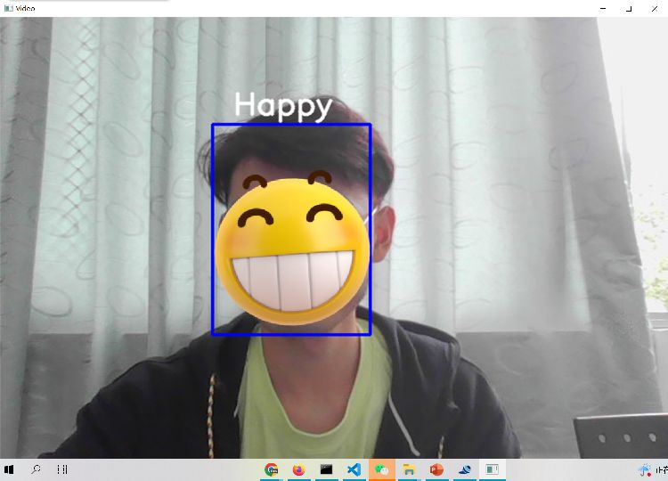
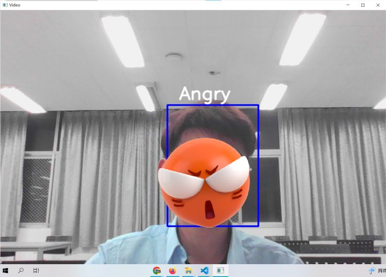
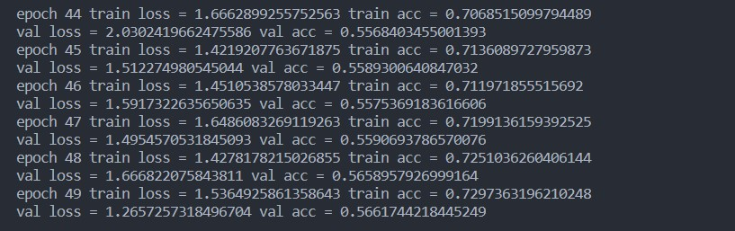
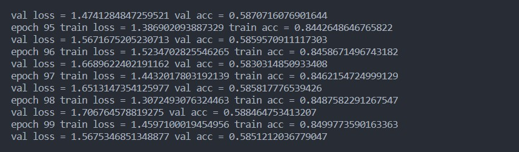
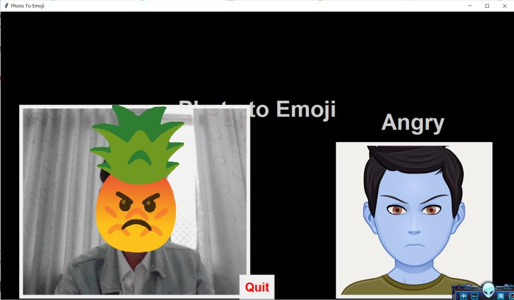

### 注：下面的回答默认是以项目源代码（利用keras接口实现）为背景。我另外用pytorch重演了这个项目，如果以pytorch为框架回答的问题我会注明
# 1.环境配置
+ [tensorflow, python, cudatoolkit, cudnn 对应版本链接](https://tensorflow.google.cn/install/source_windows?hl=en#gpu)
+ 我目前的原项目版本  
tensoflow-gpu 2.3.0  
cudatoolkit 10.1  
cudnn 7.6  
keras 2.4.3  
+ pytorch 版本  
torch 1.11  
torchvision 1.12
## 一些小心得
+ conda 和 pip 下载和安装的内容可能不同
+ pip 无 cudatoolkit 和 cudnn
+ conda 里并没有全部版本的 cudatoolkit 和 cudnn
+ 另外，还要
```
pip install opencv-python
pip install pillow
```
这期间我还阴差阳错更新了nvidia game ready，不知道是不是有用（听名字纯打游戏用的）

# 2.源代码注释已添加
# 3.复现截图


原谅我暂时不想露脸，自己贴了一个表情才把照片发出来  
  
另外，使用源代码的keras接口loss和accuracy始终稳定在1.8和0.25，我修改了学习率、权重衰减、优化器类型甚至简单改变网络结构，都无法改变情况,而且浪费了大量时间。  
所以我（不得不）用pytorch复刻了这个项目，并没有出现上面的情况，但在该项目给定的模型及训练轮数下，可以看出该模型的效果并不理想，且存在过拟合的倾向。  
  
我把训练轮数改为100，可以看出典型的过拟合。  
  
由此可以得出，该项目的网络本身存在缺陷；另外，本项目的数据集也有不当之处，例如angry类的有些图片看起来更像sad或fearful，或者说这个表情本身就属于多个类别，再加上表情分类的复杂性大于普通的分类。如果有时间我会更改网络再训练（有一次用自定义的网络时跑了十几轮，感觉拟合效果还可以，时间充裕的话我会先用它试试）。  
~~对了，还有gui运行页面，这是在用pytorch复现之前导入keras接口实现的训练结果运行的，如果有时间的话我会导入pytorch的训练结果重新写一个gui的代码~~  
导入pytorch的训练结果的 gui 页面截图如下  


# 4.对第五个问题的回答
## （1）载入数据
源代码的注释将细节解释地较为清楚，这里说一下大概：
先用ImageDataGenerator() 定义两个generator, 然后用flow_from_directory()将路径里的图片导入到generator并进行预处理，如将每个像素*1/255, 指定尺寸，变为灰度图等，随后就可以将generator传入对应接口  
### pytorch版
先用transforms.Compose([...])设定好要预处理的操作，然后用ImageFolder载入图片并执行预处理，预处理的操作和上面写的都差不多，最后用DataLoader()生成loader
## （2）如何设计trainer
通过keras的接口实现。损失函数为交叉熵损失函数，优化器为adam，训练次数为epochs，generator每批数据量为64
### pytorch版
自己实现的，大致和上面差不多
## （3）网络架构
CNN（一个很小的vgg？）。三个卷积块+全连接。
  
  github仓库：https://github.com/syGOAT/forjotang
